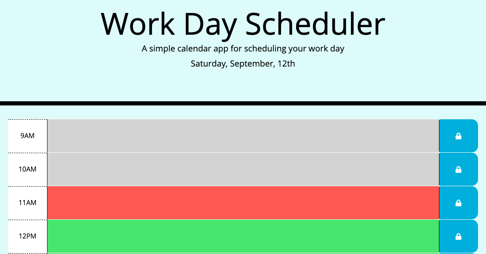

# work-day-scheduler

## The Repository
This site is stored in the "work-day-scheduler" repository on Alix's github account (username: awebb8). This repository is public.  
Link to Repository:  https://github.com/awebb8/work-day-scheduler
Link to the project's web page:  https://awebb8.github.io/work-day-scheduler/

## Project Goal
Create a simple calendar application that allows the user to save events for each hour of the day. This app will run in the browser and feature dynamically updated HTML and CSS powered by jQuery.

## Work Day Scheduler

## About the Scheduler
This Work Day Scheduler is a time management tool for anyone with a busy schedule.  It allows the user to add important events for every hour of the workday, from 9AM to 5PM.  
This planner displays the current day at the top of the screen.  It presents the user with time-blocks for the day for standard business hours.  The time-blocks are color coded to indicate whether the associate hour is in the past, present, or future.  The user can enter an event into the text area of any time-block then click the save button to save the text in local storage.  If the page is refreshed, the events remain saved. 

## Sources
The moment.js (https://momentjs.com/) library is utilized to retrieve the current date and time.
